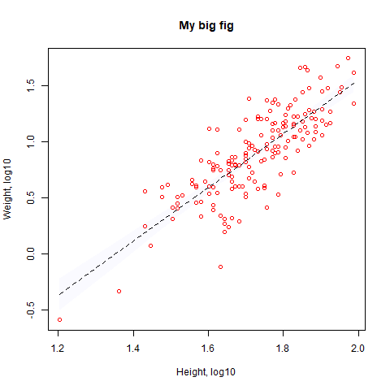

```{r setup, include=FALSE}
knitr::opts_chunk$set(echo = TRUE)
```

## Allometry Project

>How does plant weight scale with height?

- No relatioship
- Linear
- To the third power (assuming its isometric - same shape when its larger)
- To the second power (a line that keeps growing)

##Load our data
```{r}

seeds <- read.csv("https://raw.githubusercontent.com/jmadin/himbr/master/data/seed_root_herbivores.csv", as.is=TRUE)
head(seeds)
summary(seeds)
#matrix(c(1,2,4,5),c(4,6,8,3),c(5,7,6,3))


```


## A function for standard error
```{r}
standard_error <- function(x) {
  
 se <- sd(x)/ sqrt(length(x))
 return(se)
  
}
```

##Seed height/weight plotting
```{r}
#plot(seeds$Height, seeds$Weight)
plot(Weight ~ Height, data=seeds)

```

##Data Transformation
```{r}
#Add new columns
seeds$Weight_log10 <- log10(seeds$Weight)
seeds$Height_log10 <- log10(seeds$Height)
```

##Data Analysis
We will run a linear regression on log-transformed variables to look for scaling coefficient.

```{r}
mod <- lm(Weight_log10 ~ Height_log10, data=seeds)
summary(mod)
mod$coef
write.csv(mod$coef, "output/model_coefs.csv")

#anova(mod)
#abline(mod)
```
##Figures

```{r}
h <- sort(seeds$Height_log10)
pred <- predict(mod, list(Height_log10=h), interval="confidence")


png("figs/figure1.png")

plot(Weight_log10 ~ Height_log10, data=seeds, col="red", xlab="Height, log10", ylab="Weight, log10", main="My big fig")

lines(h, pred[,1], col="black", lty=2)

polygon(c(h, rev(h)), c(pred[,2], rev(pred[,3])), col=rgb(0,0,1,0.02), border=NA)

dev.off()

```
#My final plot


#Conclusions
The slope of the relationship between height and weight is `r round(mod$coefficient[2],2)`.
